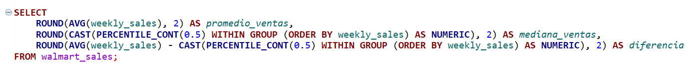
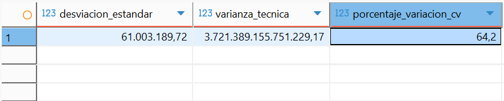
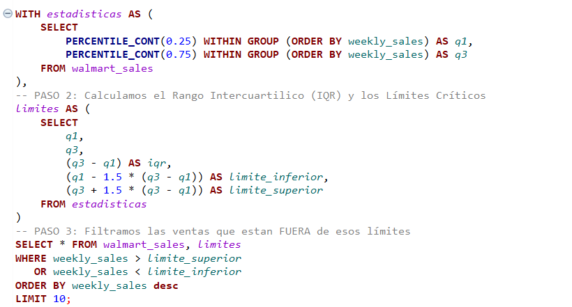

# 🛒 Walmart Sales: Análisis Estadístico y Detección de Patrones

  

## 📌 1.0 Overview
Este análisis busca identificar patrones de ventas en Walmart para entender qué factores (festivos, ubicación) impulsan los picos de rendimiento. A través de este estudio, desglosamos la estabilidad operativa de la empresa y el comportamiento de sus valores extremos utilizando **PostgreSQL**.

* **Dataset:** [Walmart Sales Dataset (Kaggle)](https://www.kaggle.com/datasets/mikhail1681/walmart-sales)
* **Herramientas:** SQL (PostgreSQL), CTEs, Window Functions.
* **Enfoque:** Análisis descriptivo de tendencia central, dispersión y posición.

## 🛠️ 2.0 Etapas del Análisis

### 2.1 Tendencia Central (El Corazón de los Datos)
* **Tarea:** Calcular el promedio y la mediana de las ventas semanales.
* **Concepto:** Se utilizó `AVG` y `PERCENTILE_CONT(0.5)` para hallar la mediana y entender el valor central real, mitigando el efecto de valores atípicos.

### 2.2 Dispersión y Variabilidad (¿Qué tan estables somos?)
* **Tarea:** Calcular la varianza, desviación estándar y el Coeficiente de Variación (CV).
* **Concepto:** `STDDEV` para medir cuánto se alejan las ventas del promedio y cálculo manual del CV para determinar la volatilidad porcentual.
* **Aprendizaje:** El análisis determinó si las ventas son constantes o presentan mucha volatilidad a lo largo del año.

### 2.3 Análisis de Valores Atípicos (Outliers)
* **Tarea:** Identificación de Outliers mediante el método del Rango Intercuartílico (IQR).
* **Aprendizaje:** Separamos las semanas de ventas "normales" de aquellas que representan fenómenos extraordinarios para el negocio.

